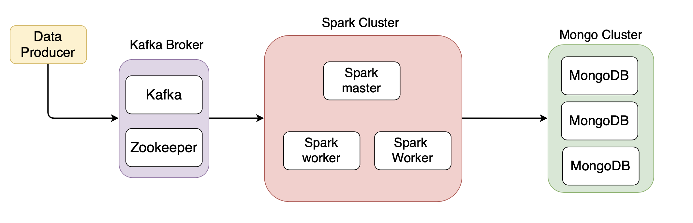

# **The overall setup**

## **Quick description**: 

  > A more detailed project explination is available in my medium **[article](https://www.mongodb.com/blog/post/getting-started-with-mongodb-pyspark-and-jupyter-notebook)**

  This project links together a **kafka cluster** (our source, where data gets deposited from a data producer), a **Pyspark cluster** (where we process the data coming from our source) and a **MongoDB cluster** (our sink, where the results of our processing gets stored).

-----------

## **Structure**:
The cluster will be represented by docker containers.
  - For **MongoDB**, we have 3 containers representing a ReplicaSet configuration (one will be the primary node and the two others secondary).
  - For **Pyspark**, we have 3 containers (our master node and two worker nodes).
  - For **Kafka**, we have 2 conatiners (one for our kafka broker and one for zookeeper)
  
   **Note**: zokeeper is just a _"manager"_ that has to be setup along with kafka for it to work, but we won't worry about it.

  - All the containers will belong to the same user-defined docker network so that they can communicate 

-----------

  
  
